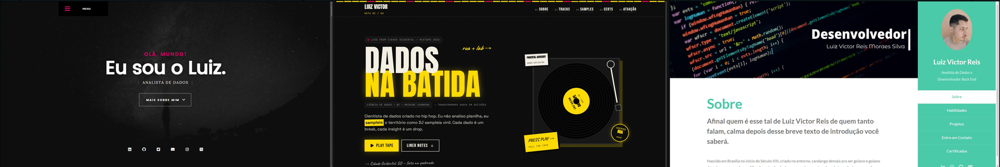
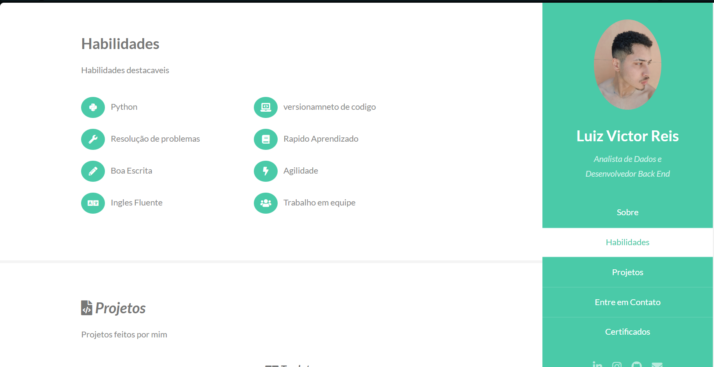
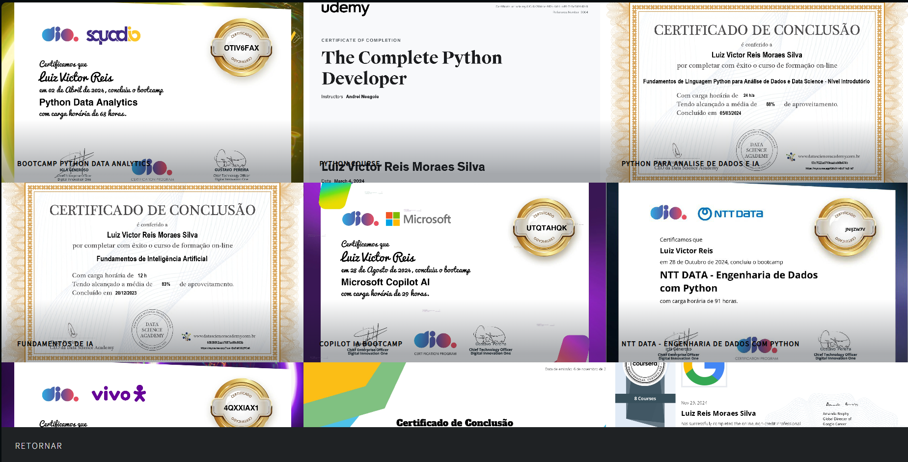
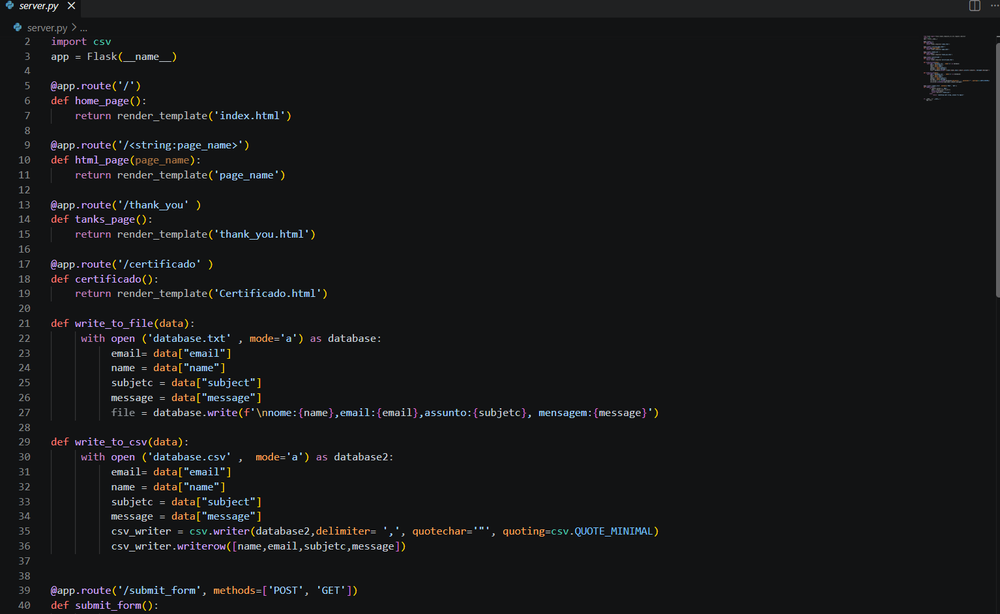
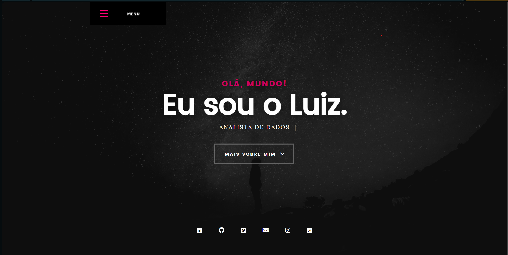
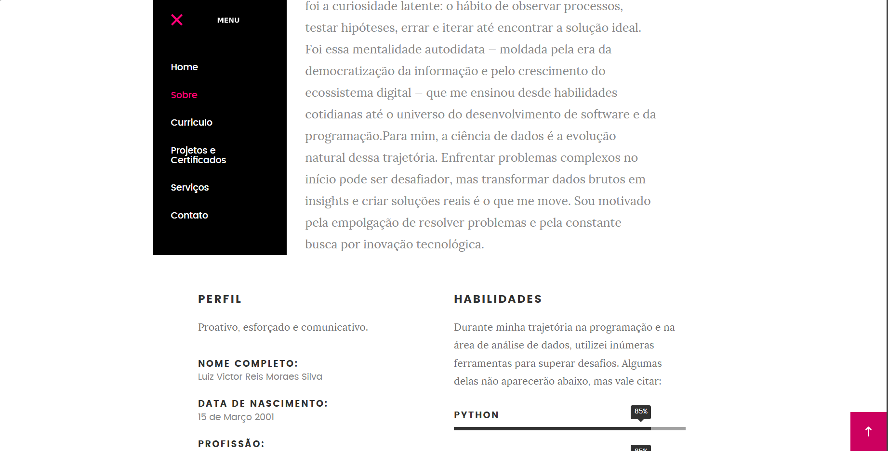
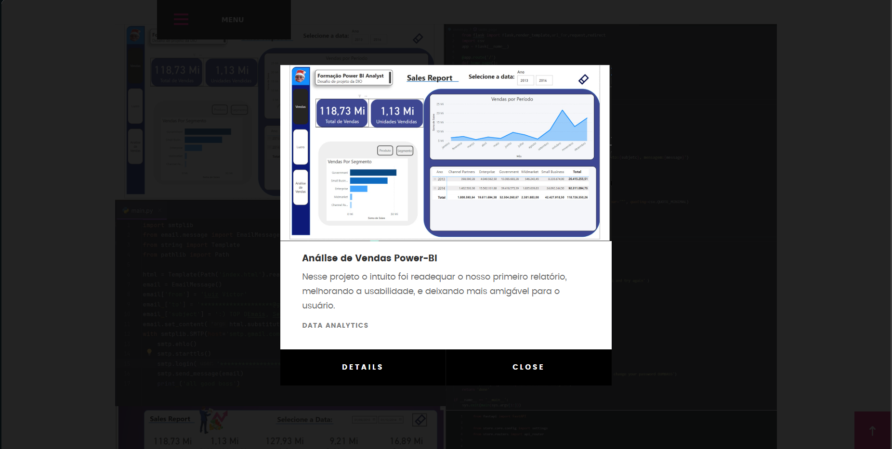
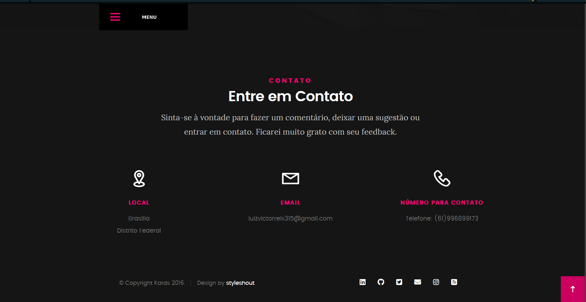

# PortfolioWeb_sites

Este projeto destaca minhas diferentes abordagens e experiências na produção de portfólios digitais.

## Sobre
Na era digital em que vivemos, saber "vender seu peixe" — o famoso *personal branding* — é uma habilidade essencial para diversas carreiras e áreas de atuação no mercado de trabalho, seja utilizando redes sociais como Instagram e LinkedIn, ou utilizando sites próprios, como é o meu caso.

O intuito deste projeto é documentar minhas experiências criando meus portfólios e as diferenças que encontrei em cada abordagem.
### Primeiro Portfólio
O meu Primeiro portfolio foi o [Meu portfólio](https://luizv315.pythonanywhere.com/), que surgiu como projeto final de um curso de Python que eu estava fazendo. O desafio era criar e publicar um portfólio pessoal utilizando Python como backend. 

#### Ferramentas utilizadas

- [HTML5up](https://html5up.net)
- [Flask](https://flask.palletsprojects.com/en/stable/#)
- [PythonAnywhere](https://www.pythonanywhere.com)

Comecei escolhendo um template no HTML5 UP que atendesse às minhas necessidades para um portfólio. Após isso, utilizei o Flask como framework backend da aplicação. O Flask foi escolhido para este projeto por ser mais simples e direto do que outros frameworks.

Após a finalização do projeto, foi necessário deixá-lo online. Para a hospedagem, optei pelo PythonAnywhere por ser uma plataforma bastante intuitiva.

### Segundo Portfólio
Neste segundo [portfólio](https://portfo-2.vercel.app/#top),a ideia foi atualizar o projeto anterior tanto em design quanto em hospedagem e backend.

#### Ferramentas utilizadas

- [Styleshout](https://styleshout.com)
- [Django](https://www.djangoproject.com)
- [Vercel](https://vercel.com) 

A princípio, o primeiro passo foi procurar um template que fosse similar ao anterior e, ao mesmo tempo, completamente diferente, pois eu achava o template anterior muito simples. Então, encontrei no Styleshout um modelo que me agradou, pois reunia tudo o que eu precisava, tanto em estilo quanto em funcionalidades.

Para o backend, eu queria testar uma ferramenta nova e mais desafiadora, e acabei optando pelo Django para cumprir esse papel. Para hospedar o site, utilizei o Vercel, que é um pouco mais complexo que o PythonAnywhere.

No fim das contas, esse projeto foi muito divertido e desafiador, pois as ferramentas utilizadas exigiram mais atenção e esforço da minha parte.

